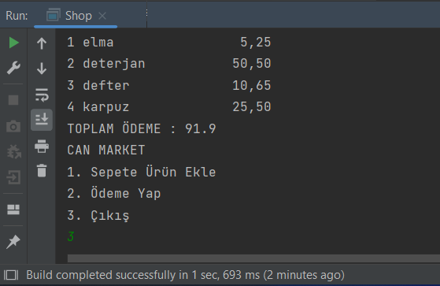

# shopping-mall
The total price is reached from the payment page by selecting the desired products from the products in the shopping application.

## Prerequisites
This project requires JDK

## Setup/Installation
1. Clone this repo into your own workspace.
2. Open the project using IDEA or VS Code
3. Run

